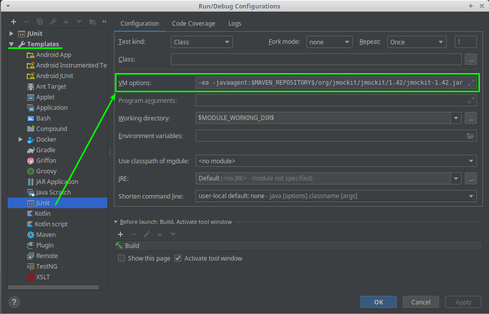

# Buggy
A framework based on testNG for testing automation

## Documentation ([RU](https://buggy.readthedocs.io/ru/master/)|EN)

## Run unit test with Intellij IDEA

1. Toolbar -> Run -> Edit Configurations...   
2. Choice JUnit configuration   
3. Add to VM options `-javaagent:$MAVEN_REPOSITORY$/org/jmockit/jmockit/1.42/jmockit-1.42.jar`   
       
4. Add code coverage configuration (jacoco) with pattern: `org.touchbit.buggy.core.*`   
       
5. Clear all existing configurations.   
       
6. Apply changes.   
7. Choice test package and run tests.   
       