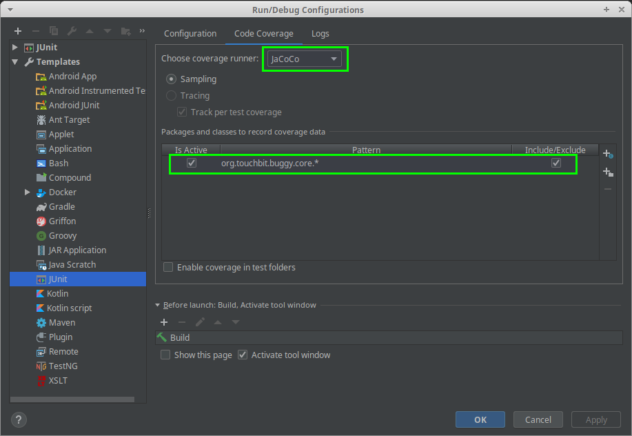
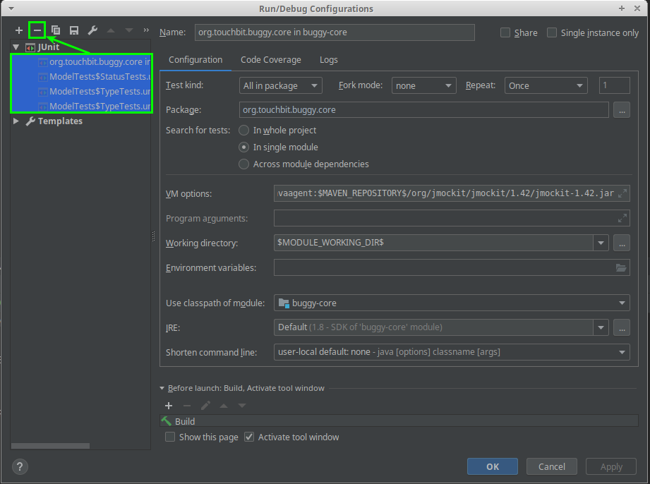
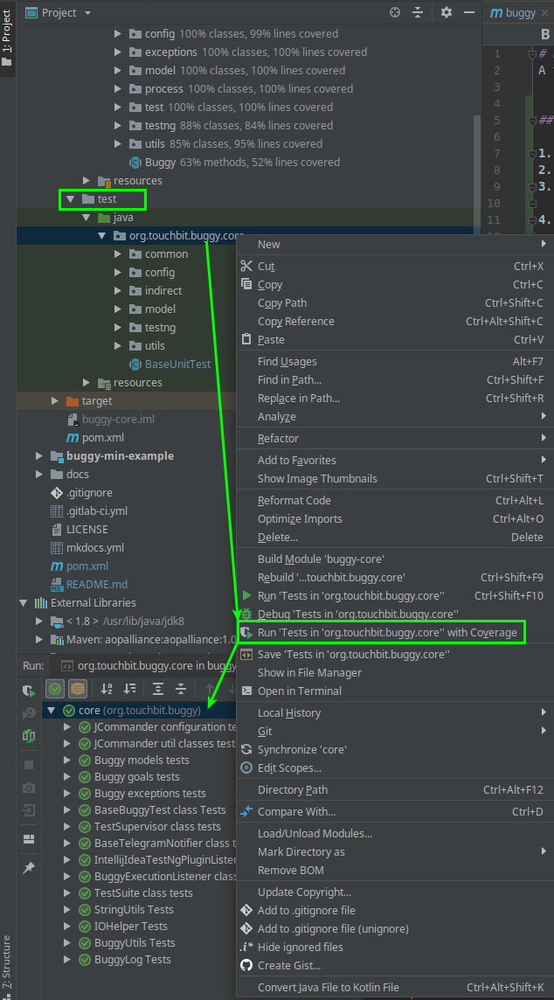

# Buggy
A framework based on testNG for testing automation

## Documentation ([RU](https://buggy.readthedocs.io/ru/master/)|EN)

## Run unit test with coverage (Intellij IDEA)

1. Toolbar ⮞ Run ⮞ Edit Configurations ⮞ Templates ⮞ JUnit   
2. Add code coverage configuration (jacoco) with pattern: `org.touchbit.buggy.*`   
       
3. Clear all existing configurations.   
       
4. Apply changes.   
5. Choice test package and run tests.   
       