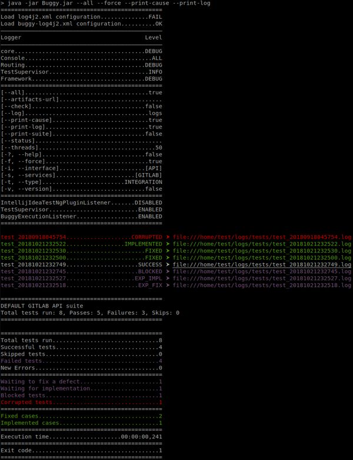

Buggy
=====

Readthedocs документация (`RU <https://buggy.readthedocs.io/ru/master/>`_ | EN) (в разработке).

.. contents:: Содержание
    :depth: 3

Описание проекта
----------------

**Buggy** - это надстройка над **TestNG** для быстрого создания/подключения тестового проекта, разработки и вариативнго запуска автотестов.

Позволяет
^^^^^^^^^

#. Легко и просто подключить TestNG к проекту с тестами. Как пример, смотреть модуль buggy-min-example.

#. Собирать готовый к исполнению jar.

#. Обрабатывать параметры запуска и расширять уже существующую конфигурацию (JCommander).

#. Автоматически собирать исполняемые тестовые классы в сьюты для последующего запуска в TestNG.

#. Автоматически собирать и добавлять в TestNG необходимые листенеры.

#. "На горячую" перезагружать настройки логирования.

#. Регулировать запуск тестов по типу.

#. Регулировать запуск тесов по компонентам, сервисам или интерфейсам тестируемой системы.

#. Транслировать результаты запуска в различные сервисы.

Реализовано
^^^^^^^^^^^

#. Управление конфигурацией запускаемых тестов.

#. Расширение существующей конфигурации через собственные интерфейсы.

#. Листенер для IntelliJ IDEA TestNG плагина для запуска тестов из IntelliJ IDEA

#. Атомарное логирование для каждого тестового или конфигурационного метода в отдельный файл.

#. Цветовая дифференциация консольных логов.

#. Механизм мониторинга исполняемых тестов.

#. Базовый Telegram-нотификатор.

#. Модуль к feign клиенту (утилиты).

#. Модуль к okhttp клиенту (утилиты).

Предстоит
^^^^^^^^^

#. Модуль интеграция c TestRail (трансляции результатов).

#. Модуль интеграция с ReportPortal (трансляции результатов).

#. Модуль к Retrofit клиенту (утилиты).

#. Модуль работы с protobuf.

Конфигурация
------------

Описание
^^^^^^^^

* ``PrimaryConfig``
    * Базовая конфигурация представлена индексируемым интерфейсом ``PrimaryConfig``.
    * Любой класс реализации интерфейса ``PrimaryConfig`` будет автоматически подгружен и использован для конфигурации по умолчанию (``Buggy.getPrimaryConfig()``).
    * Класс реализации интерфейса ``PrimaryConfig`` может быть имплементирован от множества конфигурационных интерфейсов, в том числе и из разных проектов.
    * Пример: ``org.touchbit.buggy.example.min.config.Config``

* ``SecondaryConfig``
    * Дополнительная конфигурация (команды) представлена индексируемым интерфейсом ``SecondaryConfig``.
    * Любой класс реализации интерфейса ``SecondaryConfig`` будет автоматически подгружен и создан экземпляр (``Buggy.getSecondaryConfigs()``).
    * Класс реализации интерфейса ``SecondaryConfig`` может быть имплементирован от множества конфигурационных интерфейсов, в том числе и из разных проектов.
    * Для класса реализации интерфейса ``SecondaryConfig`` обязательно наличие аннотации ``com.beust.jcommander.Parameters`` с объявленным ``commandNames``.
    * Пример: ``org.touchbit.buggy.example.min.config.NetworkConfig``

Параметры
^^^^^^^^^

.. table:: Параметры запуска

    ===================  =====  =============  ===========
    Keys                        Default        Description
    ==========================  =============  ===========
    --help               -?     false          Вывести информацию с параметрами запуска.
    -------------------  -----  -------------  -----------
    --all                       false          При запуске тестов вывести в лог все параметры конфигурации и их значения.
    -------------------  -----  -------------  -----------
    --check                     false          Проверить конфигурацию на корректность без запуска тестов.
    -------------------  -----  -------------  -----------
    --version            -v     false          Вывести версию исполяемого jar.
    -------------------  -----  -------------  -----------
    --force              -f     false          Запуск всех тестов без исключения.
    -------------------  -----  -------------  -----------
    --print-suite               false          Вывести информацию о тестовом сьюте.
    -------------------  -----  -------------  -----------
    --print-cause               false          Вывести причину падения/исключения теста.
    -------------------  -----  -------------  -----------
    --print-log                 false          Вывести в лог путь к файлу выполненного теста.
    -------------------  -----  -------------  -----------
    --log                       logs           Относительный или абсолютный путь к директории ведения логов.
    -------------------  -----  -------------  -----------
    --status                    null           Статус с которым следует принудительно завешить прогон тестов.
    -------------------  -----  -------------  -----------
    --threads                   50             Количество потоков для исполняемых тестовых методов.
    -------------------  -----  -------------  -----------
    --services           -s     Runtime        Список доступных для тестирования сервисов.
    -------------------  -----  -------------  -----------
    --interface          -i     Runtime        Список доступных для тестирования интерфейсов.
    -------------------  -----  -------------  -----------
    --type               -t     INTEGRATION    Тип проводимого тестирования.
    -------------------  -----  -------------  -----------
    --artifacts-url             null           Url к логам тестов (CI)
    ===================  =====  =============  ===========

Примеры
^^^^^^^

Вывод параметров запуска
""""""""""""""""""""""""

.. code-block:: bash

    $ java -jar buggy-min-example/target/Buggy.jar -?

    ===============================================
    Usage: Buggy [options] [command] [command options]
      Options:
        --artifacts-url
          The storage address for the builds (artifacts).
        --check
          Check buggy configuration without test run.
        -f, --force
          Running all tests, including those that fall.
        -?, --help
          Print usage.
        -i, --interface
          List of tested interfaces in the format: NAME,NAME,NAME.
          Default: [API]
        --print-cause
          Print the cause of a fail or skip test in the console log.
        --print-log
          Print the test log file path in the console log
        --print-suite
          Display information on the Suite in the console log.
        -s, --services
          List of tested services in the format: NAME,NAME,NAME.
          Default: [GITLAB]
        --threads
          The number of threads to run the test methods.
          Default: 50
        -t, --type
          Type of tests to run.
          Default: INTEGRATION
          Possible Values: [SMOKE, MODULE, INTEGRATION, SYSTEM]
        -v, --version
          Print program version
      Commands:
        network
          Usage: network [options]
            Options:
              --connection-timeout
                Connection timeout for request
                Default: 10
              --host
                Tested host
                Default: http://example.com
              --read-timeout
                Read timeout for response
                Default: 10
              --write-timeout
                Write timeout for request
                Default: 10

Запуск тестов c флагами
"""""""""""""""""""""""

Разработка и контрибьютинг
--------------------------

Документация
^^^^^^^^^^^^

Документация разработана при помощи синтаксиса reStructuredText.

Стандартный синтаксис разметки reStructuredText описан `тут <https://aaattt1.readthedocs.io/en/latest/rst-markup.html>`_

Онлайн редакторы:

#. `RSTed <http://rst.ninjs.org/>`_

#. `Notex <https://www.notex.ch/editor>`_

Исходники документации находятся в директории docs и предназначены для деплоя на сайт `buggy.readthedocs.io <https://buggy.readthedocs.io/ru/latest/>`_.

Точка входа для разработки документации: docs/index.rst

Точка входа для управление конфигурацией сборки документации: docs/conf.py

Локальная сборка html
"""""""""""""""""""""

Для локальной сборки проекта с документацией необходимо:

#. Установить `python 3 <https://www.python.org/downloads/>`_
#. Установить `sphinx-doc <http://www.sphinx-doc.org/en/master/usage/installation.html>`_
#. Выполнить сборку ``sphinx-build -W -b html ./docs ./site``

В результате в директории ``./site`` будет находится reStructuredText документация в стиле сайта ``readthedocs.org``.

Локальная сборка/запуск docker образа
"""""""""""""""""""""""""""""""""""""

**Сборка образа**

* выполнив ``make build-doc-image`` (при условии установленного ``make``)

или

* выполнив ``docker build --no-cache -t buggy/doc -f ./docs/Dockerfile .`` (точка в конце обязательна)

В результате выполнения будет создан образ ``buggy/doc:latest``

**Запуск контейнера**

* docker run -p 80:80 buggy/doc

или

* make run-doc-image

Юнит тесты
^^^^^^^^^^

Запуск unit тестов с тестовым покрытием (Intellij IDEA)
"""""""""""""""""""""""""""""""""""""""""""""""""""""""

#. Toolbar ⮞ Run ⮞ Edit Configurations ⮞ Templates ⮞ JUnit

#. Добавить конфигурацию покрытия кода (jacoco) с шаблоном: ``org.touchbit.buggy.*``

    .. image:: .indirect/img/junit_coverage.jpeg
        :align: center

#. Удалить все существующие конфигурации.

    .. image:: .indirect/img/junit_clean.jpeg
        :align: center

#. Применить измнеения.

#. Выбрать тестовый пакет(ы) и выполнить тесты.

    .. image:: .indirect/img/junit_run.jpeg
        :align: center

