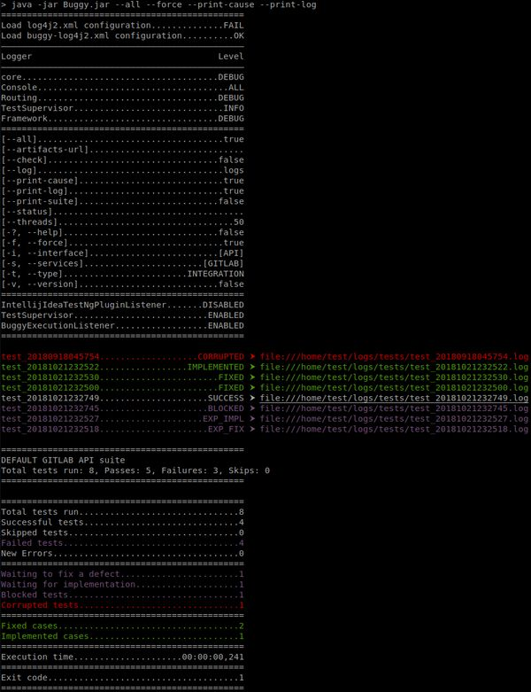

Конфигурация
============

PrimaryConfig
-------------

* Базовая конфигурация представлена индексируемым интерфейсом ``PrimaryConfig``.
* Класс реализации интерфейса ``PrimaryConfig`` будет автоматически подгружен, создан экземпляр и использован для конфигурации по умолчанию (получить: ``Buggy.getPrimaryConfig()``).
* В случае наличия несколькоих классов реализации интерфейса ``PrimaryConfig``, класс требуемой конфигурации задаётся явно - ``Buggy.setPrimaryConfigClass()`` (в случае многомодульностьи тестового проекта).
* Класс реализации интерфейса ``PrimaryConfig`` может быть имплементирован от множества конфигурационных интерфейсов, в том числе и из разных проектов.
* Значения парамтеров 'по умолчанию' переназначаются в классе реализации. Пример ``org.touchbit.buggy.example.min.config.Config``:

.. code-block:: java

    public class Config implements PrimaryConfig {

        public Config() {
            setPrintLogFile(true);
        }
    }

SecondaryConfig
---------------

* Дополнительная конфигурация (команды) представлена индексируемым интерфейсом ``SecondaryConfig``.
* Любой класс реализации интерфейса ``SecondaryConfig`` будет автоматически подгружен и создан экземпляр (получить список: ``Buggy.getSecondaryConfigs()``).
* Класс реализации интерфейса ``SecondaryConfig`` может быть имплементирован от множества конфигурационных интерфейсов, в том числе и из разных проектов.
* Для класса реализации интерфейса ``SecondaryConfig`` обязательно наличие аннотации ``com.beust.jcommander.Parameters`` с объявленным ``commandNames``.
* Пример: ``org.touchbit.buggy.example.min.config.MinExampleSecondaryConfig``

Параметры запуска
-----------------

.. table:: Параметры запуска

    ===================  =====  =============  ===========
    Keys                        Default        Description
    ==========================  =============  ===========
    --help               -?     false          Вывести информацию с параметрами запуска.
    -------------------  -----  -------------  -----------
    --all                       false          При запуске тестов вывести в лог все
                                               параметры конфигурации и их значения.
    -------------------  -----  -------------  -----------
    --check                     false          Проверить конфигурацию на корректность
                                               без запуска тестов.
    -------------------  -----  -------------  -----------
    --version            -v     false          Вывести версию исполяемого jar.
    -------------------  -----  -------------  -----------
    --force              -f     false          Запуск всех тестов без исключения.
    -------------------  -----  -------------  -----------
    --print-suite               false          Вывести информацию о тестовом сьюте.
    -------------------  -----  -------------  -----------
    --print-cause               false          Вывести причину падения/исключения теста.
    -------------------  -----  -------------  -----------
    --print-log                 false          Вывести в лог путь к файлу выполненного теста.
    -------------------  -----  -------------  -----------
    --log                       logs           Относительный или абсолютный путь к
                                               директории ведения логов.
    -------------------  -----  -------------  -----------
    --status                    null           Статус с которым следует принудительно
                                               завешить прогон тестов.
    -------------------  -----  -------------  -----------
    --threads                   50             Количество потоков для исполняемых тестовых методов.
    -------------------  -----  -------------  -----------
    --services           -s     Runtime        Список доступных для тестирования сервисов.
    -------------------  -----  -------------  -----------
    --interface          -i     Runtime        Список доступных для тестирования интерфейсов.
    -------------------  -----  -------------  -----------
    --type               -t     INTEGRATION    Тип проводимого тестирования.
    -------------------  -----  -------------  -----------
    --artifacts-url             null           Url к логам тестов (CI)
    ===================  =====  =============  ===========

Примеры
-------

Вывод параметров запуска
^^^^^^^^^^^^^^^^^^^^^^^^

.. code-block:: bash

    $ java -jar buggy-min-example/target/Buggy.jar -?

    ===============================================
    Usage: Buggy [options] [command] [command options]
      Options:
        --artifacts-url
          The storage address for the builds (artifacts).
        --check
          Check buggy configuration without test run.
        -f, --force
          Running all tests, including those that fall.
        -?, --help
          Print usage.
        -i, --interface
          List of tested interfaces in the format: NAME,NAME,NAME.
          Default: [API]
        --print-cause
          Print the cause of a fail or skip test in the console log.
        --print-log
          Print the test log file path in the console log
        --print-suite
          Display information on the Suite in the console log.
        -s, --services
          List of tested services in the format: NAME,NAME,NAME.
          Default: [GITLAB]
        --threads
          The number of threads to run the test methods.
          Default: 50
        -t, --type
          Type of tests to run.
          Default: INTEGRATION
          Possible Values: [SMOKE, MODULE, INTEGRATION, SYSTEM]
        -v, --version
          Print program version
      Commands:
        network
          Usage: network [options]
            Options:
              --connection-timeout
                Connection timeout for request
                Default: 10
              --host
                Tested host
                Default: http://example.com
              --read-timeout
                Read timeout for response
                Default: 10
              --write-timeout
                Write timeout for request
                Default: 10

Запуск тестов c флагами
^^^^^^^^^^^^^^^^^^^^^^^

