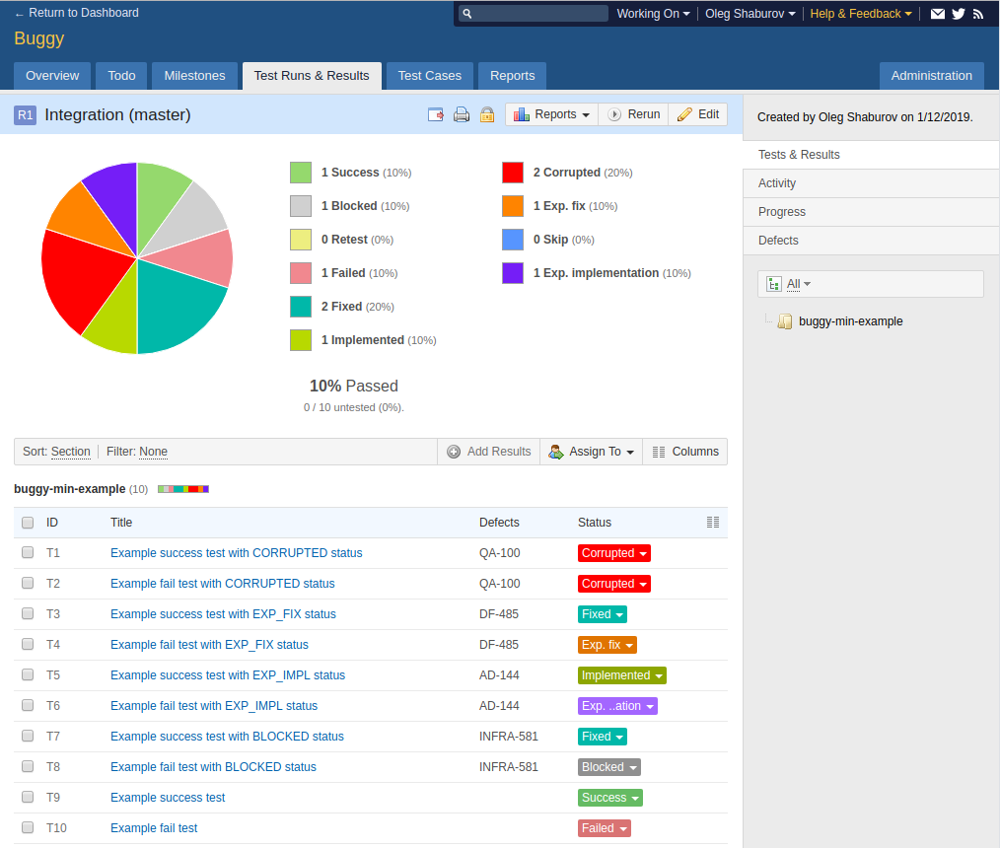
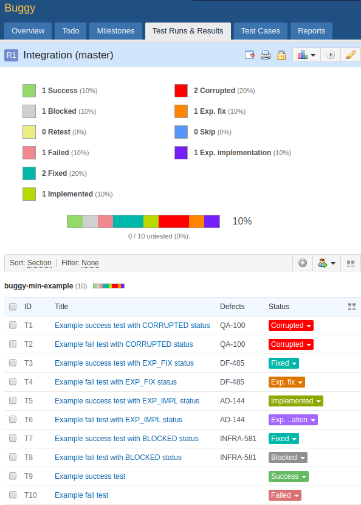
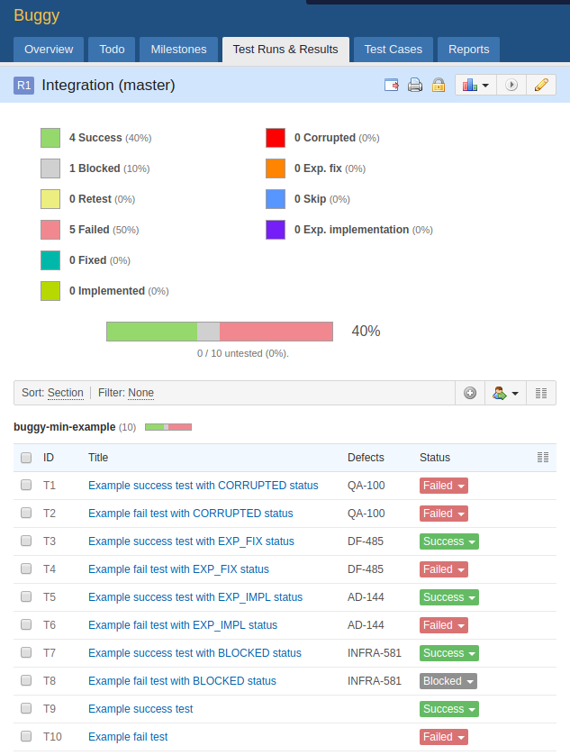

buggy-testrail
==============

TestRail
--------

If you plan to use one TestRail Run ID for autotests, then you need to make changes to the TestRail database.

#. Connect to DB (for example mysql)

    .. code-block:: bash

        mysql -u 'testrail@192.168.1.1' -pPASSWORD testrail

#. Remove restrictions from statuses

    .. code-block:: sql

        UPDATE statuses SET is_final=0;

Using
-----

.. tip:: More clearly the module connecting mechanism is shown in the `buggy-min-example` module.

Configuring pom.xml
^^^^^^^^^^^^^^^^^^^

If buggy is not used as a parent project

.. code-block:: xml

    <dependency>
        <groupId>org.touchbit.buggy</groupId>
        <artifactId>buggy-testrail</artifactId>
        <version>0.3.0</version>
        <scope>compile</scope>
    </dependency>

If buggy is used as parent project

.. code-block:: xml

    <dependency>
        <groupId>org.touchbit.buggy</groupId>
        <artifactId>buggy-testrail</artifactId>
    </dependency>

Configuring project
^^^^^^^^^^^^^^^^^^^

StatusMapper
""""""""""""

.. tip:: If you do not use custom statuses, then this item can be skipped.

To manage statuses and transfer custom statuses, you need to create a class implementing the `StatusMapper<>`
interface and define your own mapping for the statuses used. This is necessary in order for match statuses used in
Buggy with TestRail statuses. For example:

.. code-block:: java

    import org.touchbit.buggy.core.model.Status;
    import org.touchbit.buggy.testrail.StatusMapper;
    import org.touchbit.testrail4j.core.type.Statuses;

    public class StatusMap implements StatusMapper<Status> {

        @Override
        public long getId(Status status) {
            switch (status) {
                case SUCCESS:       return Statuses.PASSED.getId();
                case BLOCKED:       return Statuses.BLOCKED.getId();
                case UNTESTED:      return Statuses.UNTESTED.getId();
                case FAILED:        return Statuses.FAILED.getId();
                case FIXED:         return Statuses.CUSTOM_STATUS1.getId();
                case IMPLEMENTED:   return Statuses.CUSTOM_STATUS2.getId();
                case CORRUPTED:     return Statuses.CUSTOM_STATUS3.getId();
                case EXP_FIX:       return Statuses.CUSTOM_STATUS4.getId();
                case SKIP:          return Statuses.CUSTOM_STATUS5.getId();
                case EXP_IMPL:      return Statuses.CUSTOM_STATUS6.getId();
                default:
                    throw new RuntimeException("Unhandled status received: " + status);
            }
        }
    }

DefaultTestRailListener
"""""""""""""""""""""""

Create a listener inherited from the class `DefaultTestRailListener` and, if necessary, pass your specific
StatusMapper to the super class. For example:

.. code-block:: java

    import org.touchbit.buggy.testrail.listeners.DefaultTestRailListener;

    public class TestRailListener extends DefaultTestRailListener {

        public TestRailListener() {
            super(new StatusMap());
        }

    }

Or develop your own listener like `DefaultTestRailListener` with your own implementation of the
`afterInvocation (IInvokedMethod, ITestResult)` method

Examples
--------

Overview
^^^^^^^^

Custom StatusMapper
^^^^^^^^^^^^^^^^^^^

Default StatusMapper
^^^^^^^^^^^^^^^^^^^^

